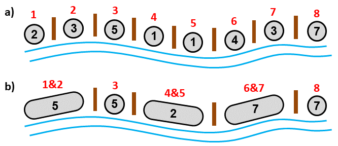

## Task

#### Buying totems in the African rainforest

Traveler Matthew Henson visits and indigenous tribe in the African rainforest. The tribes live in huts along the long river. Several huts form village, with each of the two neighboring ***villages separated by a totem*** pole built by ancient ancestors. The totems are unique and Mr. Henson is interested in buying them. He is convinced that ***each of them will sell to private collections for the price P***.  

He learns from the natives that totems between pairs of neighboring villages stand to ensure a ceasefire and good neighborly relations between the inhabitants. However, the natives do not respect the ties of their ancestors very much and are willing to negotiate the sale of totems. ***If the number of warriors in two neighboring is the same, they even offer free totem that separates the villages***, because they believe that the balance of power ensures good judicial relations. However, ***if there are more B1 warriors in one village and B2 in another, where B1 != B2, then they are more concerned and demand to pay the amount L for each warrior in which one of the villages is stronger than the other, the total amount L * | B1 - B2 |***. ***When Mr. Henson obtains one of the totems, the boundaries between the two villages disappear at the same time and the two neighboring villages become one*** (the natives have a strong idea that the boundaries of the villages are defined by totems).   

Mr. Henson may continue to negotiate the purchase of additional totems, but must reckon with the fact that the number of villages and ***the number of warriors in the villages will change with each closed trade***. The question is how many totems and in what order to gradually buy in order to maximize the profit.

The numbers of warriors in each village along the river are given, as well as the amounts of P and L. ***Determine the maximum profit Mr. Henson can make if he buys some of the totems from the natives and then sells them to private collections at the price of P for each totem. Totems are purchased sequentally.*** Each individual trade must first be made and the totem removed, before it is possible to negotiate with the natives to buy another totem. The natives will not accept another format of trade.

   

#### Input (example)

`8 1 1`  number of villages & amount for which the totem can be sold & amount the natives demand for each difference fighter when selling totems   
`2 3 4 1 1 4 3 7`  numbers representing number of fighters in each village (given in the order that corresponds to the order of the villages along the river 

#### Output (example)

`3`  maximal possible profit Mr. Henson can obtain by buying and then selling totems 

## Solution

In order to obtain time complexity of the program as small as possible (which was the main goal of these tasks) it is needed to solve this problem as a task of dynamic programming. This task is kind of similar to optimization problem of [matrix chain multiplication](https://en.wikipedia.org/wiki/Matrix_chain_multiplication) (matrix chain ordering problem). It leads us to make the table of individual elements (villages and number of their warriors in this task) together with any possible combination of the elements (merger of villages). Based on this table, bearing information on possible gains in merging villages or keeping them separeted, we can decide which mergers we have to make to maximize the profit.  

|      |vlg 1|vlg 2|vlg 3|vlg 4|vlg 5|vlg 6|vlg 7|vlg 8|
| :---: | :---: | :---: | :---: | :---: | :---: | :---: | :---: | :---: |
|**vlg 1**|`2 0 0`|`5 0 0`|`10 1 0`|`11 -3 1`|`12 -2 2`|`16 -2 2`|`19 -1 2`|`26 -2 3`|
|**vlg 2**|`0 0 0`|`3 0 0`|`8 -1 0`|`9 -5 0`|`10 -4 1`|`14 -2 1`|`17 -3 1`|`24 -6 2`|
|**vlg 3**|`0 0 0`|`0 0 0`|`5 0 0`|`6 -3 0`|`7 -1 1`|`11 0 1`|`14 0 1`|`21 -3 2`|
|**vlg 4**|`0 0 0`|`0 0 0`|`0 0 0`|`1 0 0`|`2 1 0`|`6 0 1`|`9 -2 1`|`16 -3 2`|
|**vlg 5**|`0 0 0`|`0 0 0`|`0 0 0`|`0 0 0`|`1 0 0`|`5 -2 0`|`8 -3 0`|`15 -3 1`|
|**vlg 6**|`0 0 0`|`0 0 0`|`0 0 0`|`0 0 0`|`0 0 0`|`4 0 0`|`7 0 0`|`14 1 0`|
|**vlg 7**|`0 0 0`|`0 0 0`|`0 0 0`|`0 0 0`|`0 0 0`|`0 0 0`|`3 0 0`|`10 -3 0`|
|**vlg 8**|`0 0 0`|`0 0 0`|`0 0 0`|`0 0 0`|`0 0 0`|`0 0 0`|`0 0 0`|`7 0 0`|

The cells in the table (which is for the given example above) consist of three numbers `w m p`. `w` in in the row `r` and column `c` stands for number of warriors in village made by merging villages `r` to `c`. `m` stands for maximal profit after merging villages `r` to `c`. And because some trades might be in terms of profit inefficient and in these cases it is better to leave the villages separated `p` stands for maximal profit we can get by combination of merging (some of) villages `r` to `c` and keeping (some of) them separated.  

After initial filling the main diagonal cells we can iteratively (by diagonals) get ourselves to cell in the right upper corner where the second number stands for maximal profit which is made by sequentally merging all villages into one and the third stands for maximal profit made by keeping some of them separated. The result (maximal possible profit) is maximum of these values.

#### Compiling and testing

`g++ main.c -o main`  
  
`./main < datapub/pub**.in`
